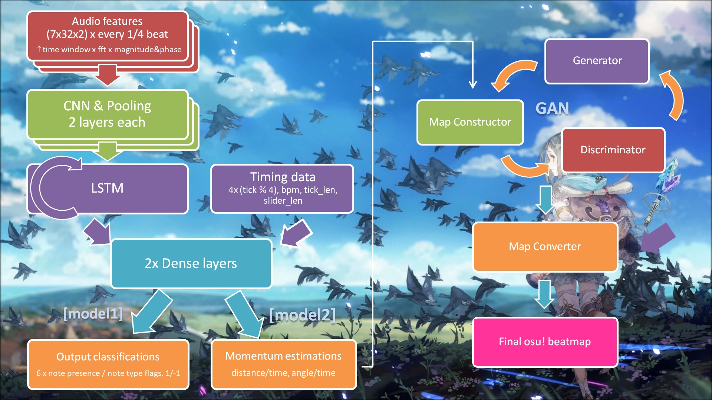

# osumapper
An automatic beatmap generator using Tensorflow / Deep Learning.

demo map: https://osu.ppy.sh/beatmapsets/834264

## Model Specification:

- Rhythm model
  - CNN/LSTM + dense layers
  - input music FFTs (7 time_windows x 32 fft_size x 2 (magnitude, phase))
  - additional input timing (is_1/1, is_1/4, is_1/2, is_the_other_1/4, BPM, tick_length, slider_length)
  - output (is_note, is_circle, is_slider, is_spinner, is_sliding, is_spinning) for 1/-1 classification
- Momentum model
  - Same structure as above
  - output (momentum, angular_momentum) as regression
  - momentum is distance over time. It should be proportional to circle size which I may implement later.
  - angular_momentum is angle over time. currently unused.
- Slider model
  - was designed to classify slider lengths and shapes
  - currently unused
- Flow model
  - uses GAN to generate the flow.
  - takes 10 notes as a group and train them each time
  - Generator: some dense layers, input (randomness x 50), output (cos_list x 20, sin_list x 20)
  - this output is then fed into a map generator to build a map corresponding to the angular values
  - map constructor output: (x_start, y_start, vector_out_x, vector_out_y, x_end, y_end) x 10
  - Discriminator: simpleRNN, some dense layers, input ↑, output (1,) ranging from 0 to 1
  - every big epoch(?), trains generator for 7 epochs and then discriminator 3 epochs
  - trains 6 ~ 25 big epochs each group. mostly 6 epochs unless the generated map is out of the mapping region (0:512, 0:384).
- Beatmap Converter
  - uses node.js to convert between map position data and .osu file
  - ~~most of its code is from 3 years ago~~

## Requirements:
- tensorflow v1.9.0 - v1.10.0
- common python libs
- soundfile
- node.js
- polynomial
- ffmpeg

## Running the model:
1. prepare a maplist.txt containing .osu files and run 01_osumap_loader.ipynb
2. run 02_osurhythm_estimator.ipynb
3. run 03_osurhythm_momentum_estimator.ipynb
4. have a rest since #4 is not currently used
5. prepare a new song with timing and run 05_newsong_importer.ipynb
6. run 06_osurhythm_evaluator.ipynb
7. run 07_osuflow_evaluator_from_rhythm.ipynb
8. find the generated .osu file under the ipynb folder and try it out in osu!

if you don't have a good idea about what map to train with, you can use the default model and start from step #5.

## Environments tested:
- win10, canopy, python3.5, tf1.9.0, no cuda
- win10, canopy, python3.5, tf1.10.0, no cuda
- google colaboratory, no GPU
- anaconda3, python3.6, tf1.10.0, the machine has no graphics card
- previous environments with GPU enabled - probably needs to set batch_size=(some smaller value) otherwise it will randomly go out of memory!!

## Current Progress:

- stage0 (completed)
- stage1 (completed)
- stage2 (completed)
- stage3 (completed)
- stage4 (completed)
- stage5 (completed)
- stage6 (completed)
- stage7 (completed)
- stage8 (?)
- description 15%
- more testing 30%
- tensorflow.js 0%
- code comments -550%
- create a map and rank it -99,999,999%

## TODO:

- stream regularization (done)
- slider shape classification
- deal with 1/3 and 1/1 maps (parametrize divisor)
- spinner classification (kind of think this is impossible...)
- play with tensorflow.js to make it usable for everyone
